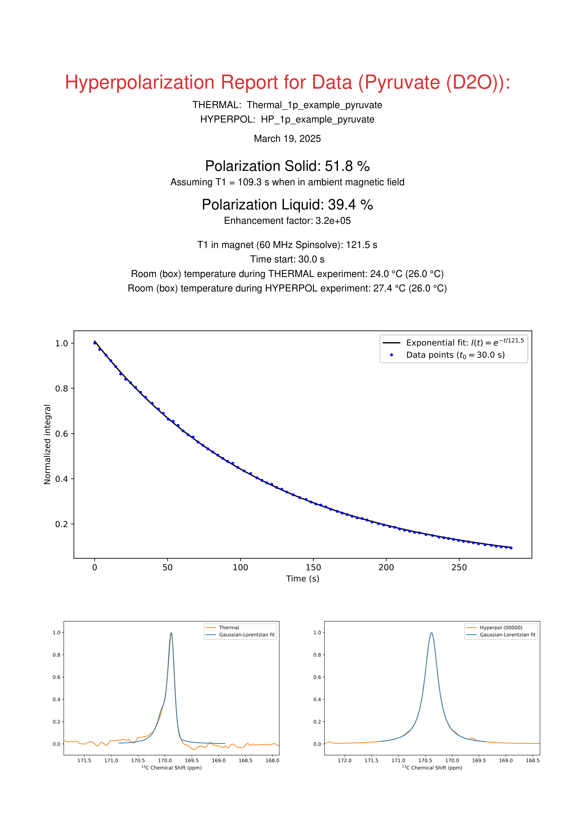
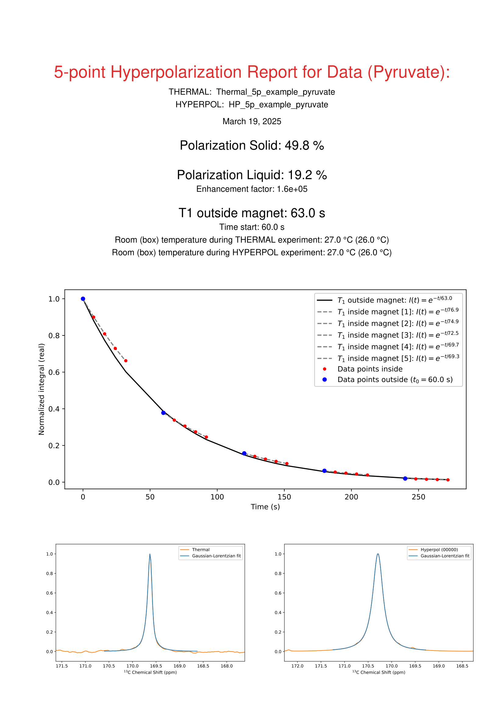

# HPpolreporter

This repository is used for generating polarization reports of 13C NMR hyperpolarization data acquired on a Magritek Spinsolve system. Data are acquired as exemplified in the pulse-programs found in the **Spinsolve_pulseprograms** folder.

Two data examples acquired on a 60 MHz Ultra Spinsolve (1H, 13C) are found in the **Data** folder. These include a *1-point polarization test* with a matching *thermal* measurement and a *5-point polarization test* with a matching *thermal* measurement. After acqusition, 1 % (v/v) Gd-DOTAREM was added to the sample to lower the T1, and the thermal measurement was acquired. For the 5-point test, the hyperpolarized compound was divided into 5 NMR tubes and kept outside the magnet and run sequentially in order to estimate the *ambient* magnetic field in the room. The generated reports from these two datasets can be found in the **Reports** folder, and looks like the following:




The two scripts **PolReport_1p.py** and **PolReport_5p.py** are used to generate the two respective reports.

## Usage

Move data acquired as specified above into the respective folders under **Data/** and run the matching script. Inputs include:
* Time between dissolution and start of acqusition (e.g. 20 seconds)
* The measured bioprobe (e.g. [1-13C]pyruvate, [1-13C]urea)
* Discarding of the first few timepoints if signal overflow was acquired (choose 1 if no discarding)

## Requirements

```
matplotlib==3.10.1
numpy==2.2.4
reportlab==4.3.1
scipy==1.15.2
svglib==1.5.1

```

## Citing this Work

If you use this repository in your research or publication, please consider citing it as follows:

Nichlas Vous Christensen, Aarhus University (2025), *HPpolreporter* (Version 1.0), GitHub repository. Available at: https://github.com/NichVC/HPpolreporter